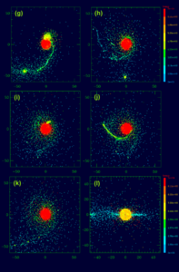
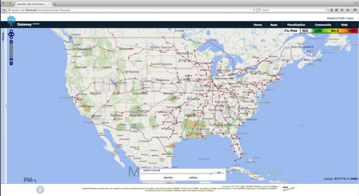
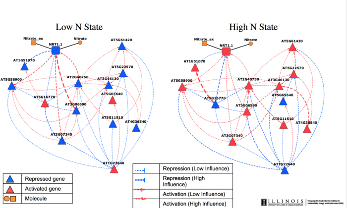

## Visualization Reports

---

## Today

 * Returning (triumphantly?) to vega-lite on iodide
 * Visualization audiences

---

## Iodide and vega-lite

I *think* I figured out the source of all our troubles last time.  There may have been strange issues with the order-of-access for the fetched javascript libraries.

We should change:

```
%% fetch
js: https://cdn.jsdelivr.net/npm/vega@5
js: https://cdn.jsdelivr.net/npm/vega-lite@4
js: https://cdn.jsdelivr.net/npm/vega-embed@6
```

to a one-at-a-time set of fetches:

```
%% fetch
js: https://cdn.jsdelivr.net/npm/vega@5
%% fetch
js: https://cdn.jsdelivr.net/npm/vega-lite@4
%% fetch
js: https://cdn.jsdelivr.net/npm/vega-embed@6
```

---

## A few Iodide Helpers

There are a few helpers for iodide that you may find useful:

```js
iodide.output.text("Hello there!")
```

This function will produce output, in your report view, that is the content of its arguments.
If you have an object, it will likely produce the unhelpful `[Object object]` but you can address this by wrapping your object in `JSON.stringify` like so:

```js
iodide.output.text(JSON.stringify(schema))
```

---

## Iodide fetching and files

Iodide can manage files; these are not shared between users of a notebook.

You can see the [documentation](https://iodide-project.github.io/docs/api/) for this, but we will not be using it in class.  It allows you to:

 * Save a file (from data in your iodide instance)
 * Load a file (from your iodide instance, but *not* shared between users)
 * List files and check for existence of files

---

## Pyodide API

Recall that we can run Python code in Iodide using the `%%py` cell type.  In Python, we can obtain access to our Javascript objects by `import`ing them from `js`:

```
%% js
var a = {1: 2, 3: 4};
%% py
from js import a
a
```

This will create the `a` object in Javascript, and make it accessible in Python by importing it.  Note that we're not `print()`-ing `a`, but instead allowing it to be displayed as the final statement in the cell.

---

## Pyodide API

We can also dynamically access properties in the Javascript from Pyodide using the `js` module.  For instance, we can examine properties of our `document`:

```
%% py
import js
js.document.title
```

---

## Iodide accessing Pyodide

As we saw in a previous class, we can also access Python (Pyodide) values in Javascript.  For example:

```
%% py
import numpy as np
a = [1, 2, 3, 4]
b = np.random.random(5)
%% js
var a_js = pyodide.pyimport('a');
var b_js = pyodide.pyimport('b');
```

Note that Iodide and Pyodide know how to convert between Javascript [TypedArray](https://developer.mozilla.org/en-US/docs/Web/JavaScript/Reference/Global_Objects/TypedArray) and NumPy [`ndarray`](https://numpy.org/doc/stable/reference/generated/numpy.ndarray.html) objects.

---

## Iodide and Objects

It's also possible -- with a number of caveats! -- to pass more complex objects back and forth, and to rely on proxy calls.

```
%% py
class ExampleClass:
    def __init__(self, something):
        self.something = something
    def get_name(self):
        print(self.something)
        return self.something
c = ExampleClass('hi')
%% js
my_obj = pyodide.pyimport('c')
my_obj.get_name();
```

---

## Passing Data Back

This ability to pass data also allows us to do things in pandas and immediately have them visible in Javascript.  For instance, we can do something like this:

```
%% js
var my_schema = {'data': {'values': []}};
%% py
from js import my_schema
my_schema['data']['values'] = [
  {'a': 1, 'b': 2},
  {'a': 3, 'b': 4},
  {'a': 5, 'b': 6}
]
%% js
my_schema['data']['values']
```

and we have modified, in place, our data values.

---

## Iodide and Fetching Data

We've seen our usage of `%%fetch` cells already for accessing javascript libraries, but we can furthermore use it to access datasets.

These are the acceptable forms of `fetch` to assign to variables:

 * `text` can be anything regarded as textual data, such as CSV or prose
 * `arrayBuffer` is a binary-interpretable dataset, which can then be turned into a `TypedArray`
 * `json` will be accessed and parsed into a javascript object directly
 * `blob` will simply be a blob of binary data (specifically in [`Blob`](https://developer.mozilla.org/en-US/docs/Web/API/Blob) format
 * `bytes` will be accessed and stored as a `UInt8Array` object.

---

## Brief Exploration Time

We will pick up roughly where we left off, except this time we will work on
creating a character generator and visualizer.

 1. Set up a simple display of attributes
 2. Get input for the name of a character, and on a button press, add it to a list of values
 3. Roll attributes for the character
 4. Supply this to vega-lite

---

## Classes of Visualization

1. Viz for Self
1. Viz for Colleagues
1. Viz for Others

---

## Viz for Self

We can think of this as telling a story to yourself.

You can take shortcuts -- you can skip labels, colors, and so on, *sort of*.  You just have to make sure you're not lying to yourself.


---

## Viz for Self

How do we explore data?

 * What characteristic of data influence how you visualize it?
 * What information do you have that would be visually interesting?
 * What information do you *not* have that you need in order to understand the importance of the data?
<div class="r-stack">
<p class="fragment fade-in-then-out">Example: A banking database where each record is a bank transaction and the fields include date, deposit or withdrawal amount, customer id, and the interest rate of the account.</p>
<p class="fragment fade-in-then-out">Example: A spreadsheet of experimental crop growth measurements where each record is a measurement, and the fields include date, plant species, plant id number, number of leaves, plant height, number of internodes, and average leaf length.</p>
<p class="fragment fade-in-then-out">Example: A computational simulation of a galaxy where each record is a timestep in the evolution of the 3D grid, and the fields include time, X position, Y position, Z position, gas density, gas temperature, gas metallicity, and number of stars.</p>
</div>

---

## Viz for Self

What do you want to get out of visualization for yourself?

 * Do you want to find meaning?
 * Do you want to understand how to guide further visualizations?
 * Is the story you want to tell already known to you?
 * What __shortcuts__ can you take?

---

## Viz for Experts

To design a visualization for experts, you need to analyze how they process information.

 * What do they know?
 * What conventions will they assume?
 * Are they able to fill in the blanks of information?

---

## Viz for Experts

<iframe width="1024" height="576"
src="https://www.youtube.com/embed/FG1NNH7Kmok?rel=0" frameborder="0"
allow="encrypted-media" allowfullscreen></iframe>

notes:
This is from Chris Havlin, and it's vorticity of a tornado

---

## Viz for Experts



notes:
Here's a series of visualizations made by or for domain experts that I just had lying around on my laptop.

What are some things you notice they have in common?

---


## Viz for Experts



notes:
Here's a series of visualizations made by or for domain experts that I just had lying around on my laptop.

What are some things you notice they have in common?

---

## Viz for Experts



notes:
Here's a series of visualizations made by or for domain experts that I just had lying around on my laptop.

What are some things you notice they have in common?

---

## Viz for Experts

Experts often want to interrogate the data themselves.

How can they do that?
 * Linked Dashboards
 * Side-by-side comparison plots
 * Text annotation with specific values listed
 * Color bar annotation

notes:
ask students - other ideas? what about interactivity? (Interactivity needs to be decent)

---

## Viz for Experts

Experts are looking to isolate variables to make scientific conclusions.

How can we make visualizations more analytical?
 * Reduce the dimensionality of the image (slices)
 * Viewpoint from "outside the box"
 * Extremely high contrast color choices (or highlight different features)

notes:
ask students - other ideas? What about animated data?

---

## Viz for the Public

This is what you're most accustomed to, because usually YOU are the public.

We will cover this one ... next time! <!-- element: class="fragment" -->
